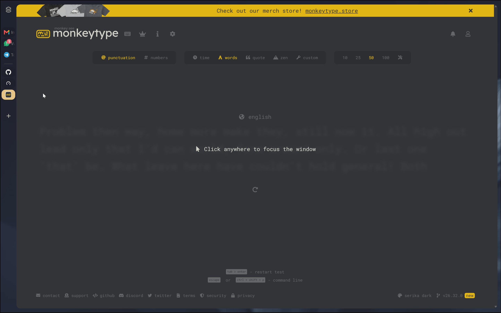
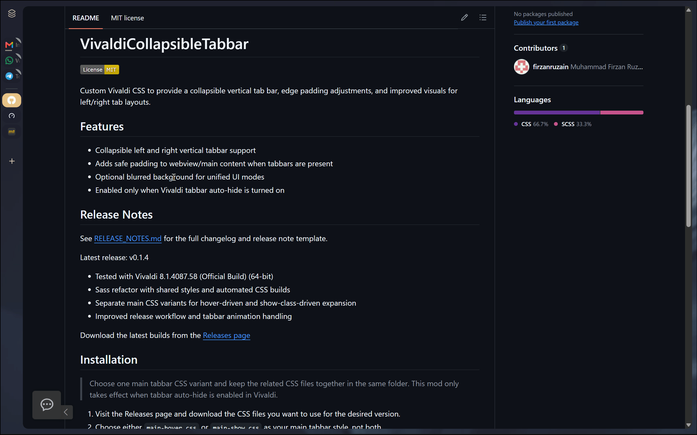
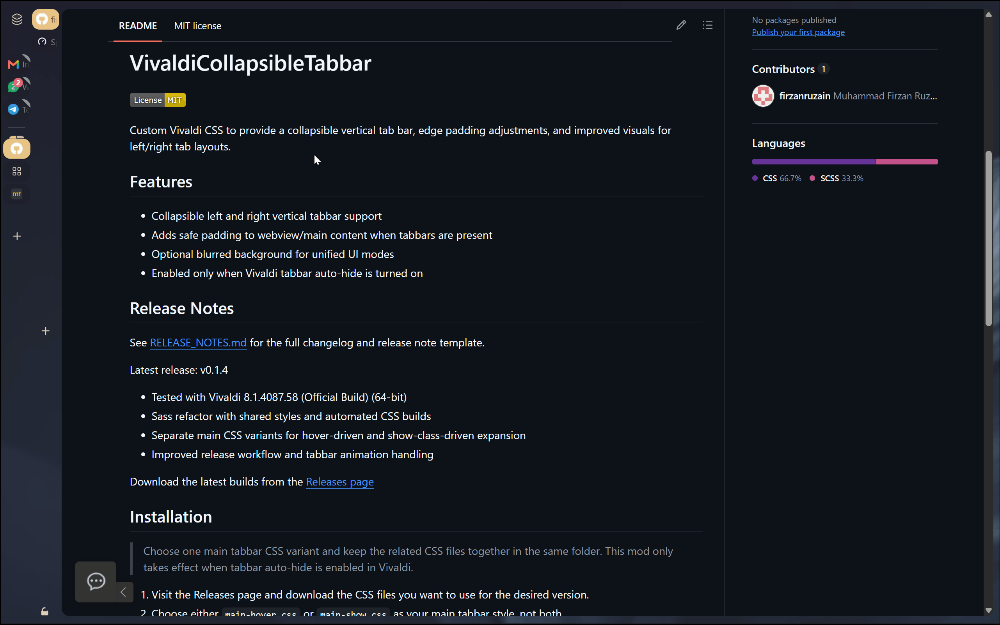
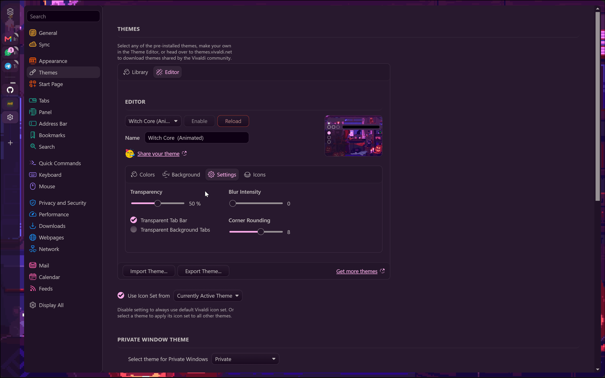

# VivaldiCollapsibleTabbar

Custom Vivaldi CSS to provide a collapsible vertical tab bar, edge padding adjustments, and improved visuals for left/right tab layouts.

## Features
- Collapsible left and right vertical tabbar support
- Adds safe padding to webview/main content when tabbars are present
- Optional blurred background for unified UI modes
- Enabled only when Vivaldi tabbar auto-hide is turned on

> 
> show version

> 
> hover version

> 
> two level tab-stacking

> 
> adapt to theme

## Release Notes
See [RELEASE_NOTES.md](RELEASE_NOTES.md) for the full changelog and release note template.

Latest release: [v0.1.4](https://github.com/firzanruzain/VivaldiCollapsibleTabbar/releases/tag/0.1.4)
- Tested with Vivaldi 8.1.4087.58 (Official Build) (64-bit)
- Sass refactor with shared styles and automated CSS builds
- Separate main CSS variants for hover-driven and show-class-driven expansion
- Improved release workflow and tabbar animation handling

Download the latest builds from the [Releases page](https://github.com/firzanruzain/VivaldiCollapsibleTabbar/releases)

## Installation
> Choose one main tabbar CSS variant and keep the related CSS files together in the same folder.
> This mod only takes effect when tabbar auto-hide is enabled in Vivaldi.

1. Visit the Releases page and download the CSS files you want to use for the desired version.
2. Choose either `main-hover.css` or `main-show.css` as your main tabbar style, not both.
3. Put the chosen main CSS file together with `tabStacking.css` and `webview.css` in the same folder so Vivaldi can load them together.
4. Enable CSS experiments at [vivaldi://experiments/](vivaldi://experiments/) if needed.
5. In Vivaldi go to Settings → Appearance → Custom UI Modifications and point to that folder.
6. Restart Vivaldi and toggle tabbar auto-hide to see the effect.

### Which main variant should I use?
- `main-show.css`: the tabbar expands when Vivaldi applies its own show class, which happens when the mouse reaches the edge of the app window.
- `main-hover.css`: the tabbar expands immediately when the mouse hovers over the tabbar area.
- Use only one of these main files at a time, along with `tabStacking.css` and `webview.css`.

### Known limitations
- `main-hover.css`: if you right-click the tabbar and the context menu appears, the tabbar will collapse.
- `main-show.css`: if the address bar is in auto-hide mode, the tabbar will collapse when the address bar is visible.

For community tips and advanced modding, see: https://forum.vivaldi.net/topic/10549/modding-vivaldi

## Troubleshooting
- If the tabbar does not change, confirm that you are only using one main file: either `main-hover.css` or `main-show.css`.
- Make sure `tabStacking.css` and `webview.css` are in the same folder as the main CSS file.
- If the padding or animation looks wrong, check whether the issue happens in maximized mode, unified UI, or only when the tabbar is left/right and auto-hidden.
- If hover expansion or show-class expansion does not work, verify that your setup matches the selected main variant.
- If Vivaldi ignores the CSS entirely, recheck the Custom UI Modifications folder path and restart the browser after any file changes.
- When reporting a bug, include your Vivaldi version, OS, tabbar position, main CSS variant, and whether the issue appears in a clean profile.

## Contributing
- Open an issue or submit a PR with specific tweaks or compatibility fixes. Please include your Vivaldi version and a short description of the DOM/state that needed adjustment.

## License
This project is licensed under the MIT License — see the [LICENSE](LICENSE) file for full text.

Copyright (c) 2026 mfr.fs

---
Small, focused CSS tweaks to make vertical tabbars behave nicely in Vivaldi. Report [issues](https://github.com/firzanruzain/VivaldiCollapsibleTabbar/issues) in the repo.
